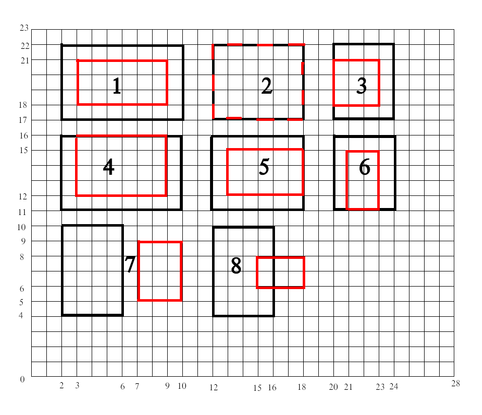

# Intersection

```
You must be able to determine whether two rectangles have one or more intersecting
lines and produce a result identifying the points of intersection.
```

### Definition

**Intersection** is defined as the point where a line segment of one rectangle crosses over into the body of the other rectangle. 
Adjacent edges, as seen in #7 in the diagram below, are not considered intersecting because there are an infinite number of shared points.

### Implementation

* The `Rectangle` class provides a `getIntersectingPoints` method which returns a set of intersection points.  There are either 0, 2 or 4 intersection points.
* An additional feature (not part of the requirement stated above) has been added:  a `getIntersection` method returns a `Rectangle` representing the overlapping region.
* The JUnit tests verify the scenarios illustrated in the diagram below.

Note:  In the diagram below, the red rectangle numbers refer to the entire red rectangle, NOT an overlapping or non-overlapping region.


# Containment

```
You must be able to determine whether a rectangle is wholly contained within another rectangle.
```

### Definition

**Containment** is defined as total encapsulation, no shared edges.  In the image below, containment only exists in #1.

### Implementation

* There are three API methods:  `contains`, `isContainedBy`, and `hasContainmentWith`.
* The JUnit tests verify the scenarios illustrated in the diagram below.



# Adjacency

```
Implement the ability to detect whether two rectangles are adjacent.
```

### Definition

**Adjacency** is defined as the sharing of at least one side. Side sharing may be proper, sub-line or partial.
A sub-line share is a share where one side of rectangle A is a line that exists as a set of points wholly contained on some other side of rectangle B, where partial is one where some line segment on a side of rectangle A exists as a set of points on some side of Rectangle B

### Implementation

* Use `isAdjacentTo` to determine if two rectangles are adjacent. 
* The Junit tests verify the scenarios illustrated in the diagram below.


